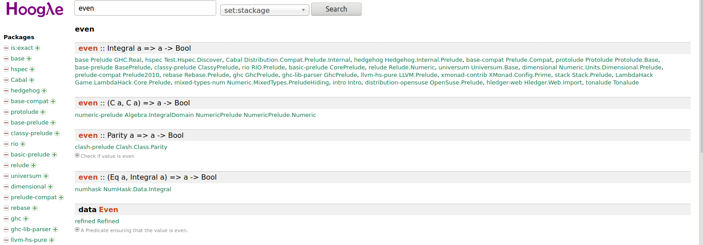
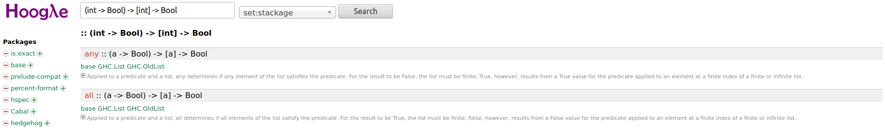

- [Requirements](#requirements)
  - [Running executable](#running-executable)
- [Finding useful functions](#finding-useful-functions)
  - [Hoogle](#hoogle)
  - [Type holes](#type-holes)

## Requirements

Complete all the exercises as per the instructions found in the code files. All tests must pass. There must be no compilation warnings or errors.

Recommended order:

1. `Maybe.hs`
2. `Examples.hs`
3. `Parser.hs`
4. `BinTree.hs` (supplementary, but highly recommended)

### Running executable

In `app/Main.hs`, we have implemented an executable function that takes in an input string for a binary tree, and outputs the prettified binary tree. This will only work after implementing `src/BinTree.hs`.

You can run this executable using `stack run`.

## Finding useful functions

Haskell comes with a very powerful in built library named 'Prelude', which has a whole bunch of useful functions. Some functions in the Prelude you will have to implement over the coming weeks.

However, it is also very useful to know how to explore the functions already use them to create some very useful functions!

There are a couple of standard approaches that we will be recommending in this unit. Have a try using the following techniques and tools, and if you get stuck, please make sure to let your tutor know or make an Ed post.

### Hoogle

[Hoogle](https://hoogle.haskell.org/) is a search engine for the Haskell API that allows searches on function name or type signature.

In this example we will be making a function `allEven` which takes in a list of integers and checks if all numbers are even.

The first thing we need is a function which check if a number is even. Lets not re-invent the wheel, we should try to use pre-written functions as much as possible. So we will search hoogle for the keyword `even`. The first result is a function `even` which takes an `Integral` (similar to integers) and returns a `Bool`.



We can use the interactive haskell terminal to ensure this function has the desired behaviour. Type in to your GHCi instance `even 4`. What does it return? How about for `even 3`?

```
*Main Instances JSON Parser Paths_exercises
ghci> :t even
even :: Integral a => a -> Bool

*Main Instances JSON Parser Paths_exercises
ghci> even 4
True

*Main Instances JSON Parser Paths_exercises
ghci> even 3
False
```

We know we now we can create `allEven` function with a combination of `filter`, `map` and `reduce` (How?) to solve this task. But lets check hoogle if this can be achieved using a library function!

This mystery function should take `even`, match it to some list of integers, and tell us if all of the integers are even. The types for the inputs and output are:

- Input Types: Function to check even-ness `even :: (Int -> Bool)`, list of integers `[Int]`
- Output Type: `Bool`

Hoogle is a useful tool, because not only can we search keywords like above, but we can search for types! Lets search for a way to connect our known types.



he results of search for the type is shown above. We have two options `all` or `any`. Looking at the documentation we can see that `all` is the function we want

```
allEvens l = all even l
```

So the function allEven is very similar to English! This is an example of very declarative code! Hoogle is a very useful search engine allowing you to easily find haskell functions!

### Type holes

A useful GHC feature that will help you with this is type holes which allow the compiler to tell you the expected type at a location, and suggestions

Suppose we have identified the `even` function. We can then use a type hole in the implementation to find the type of function we are trying to find. What this looks like in GHCi:

```
*Main Instances JSON Parser Paths_exercises
ghci> (_ even [1]) :: Bool

<interactive>:30:2: error:
    • Found hole: _ :: (Integer -> Bool) -> [Integer] -> Bool
    • In the expression: _
      In the expression: (_ even [1]) :: Bool
      In an equation for ‘it’: it = (_ even [1]) :: Bool
    • Relevant bindings include
        it :: Bool (bound at <interactive>:30:1)
      Valid hole fits include
        all :: forall (t :: * -> *) a.
               Foldable t =>
               (a -> Bool) -> t a -> Bool
          with all @[] @Integer
        any :: forall (t :: * -> *) a.
               Foldable t =>
               (a -> Bool) -> t a -> Bool
          with any @[] @Integer
```

Importantly, the compiler has told us `Found hole: _ :: (Integer -> Bool) -> [Integer] -> Bool` meaning that we want a function of the type `(Integer -> Bool) -> [Integer] -> Bool`.

Then, there are the suggested functions `all` and `any`.

Try putting type holes in your code implementations as well! Your HLS and compiler should pick up the type holes and give similar suggestions and type hints.
